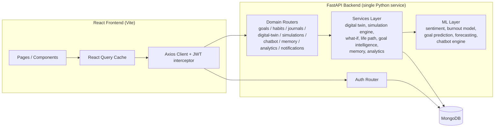
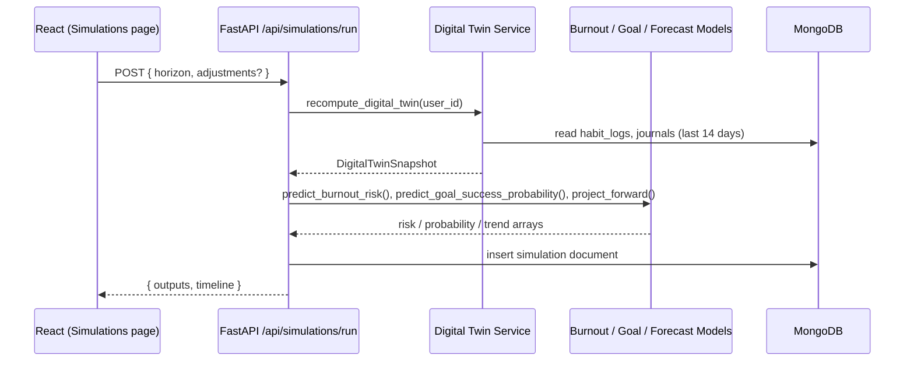

# VisionaryX

**Predict Possibilities. Shape Reality.**

An AI-powered Future Self Decision Simulator and Digital Twin platform. VisionaryX analyzes habits, emotions,
productivity, and goals to simulate *probable* future outcomes — it does not claim to predict the exact future.

> Stack note: per project direction, the backend and AI/ML layer are unified into a single **Python (FastAPI)**
> service instead of a Node/Express + separate Python microservice split. Frontend is **React.js**. Database is
> **MongoDB**.

---

## 1. Tech Stack

| Layer | Technology |
|---|---|
| Frontend | React 19, Vite, Tailwind CSS v4, Framer Motion, React Router, Axios, Recharts, TanStack React Query |
| Backend + AI/ML | Python, FastAPI, Motor (async MongoDB driver), Pydantic v2, scikit-learn, VADER Sentiment |
| Database | MongoDB (local by default, Atlas-ready) |
| Auth | JWT (access + refresh), bcrypt password hashing |

### Why heuristic + lightweight ML instead of DistilBERT/XGBoost/LSTM/Prophet

The original brief called for full transformer/deep-learning models. Per the confirmed build direction, VisionaryX
instead uses:

- **Sentiment/Emotion detection** — VADER (lexicon-based) blended with keyword-weighted emotion scoring
  (`backend/app/ml/sentiment.py`). Fast, dependency-light, no model download.
- **Burnout prediction** — `RandomForestRegressor` trained on synthetically generated seed data from a
  domain-expert formula (`backend/app/ml/burnout_model.py`).
- **Goal completion prediction** — `LogisticRegression`, same synthetic-seed-data approach
  (`backend/app/ml/goal_prediction.py`).
- **Time-series forecasting** — damped linear-trend extrapolation standing in for LSTM/Prophet
  (`backend/app/ml/forecasting.py`), honest about its confidence given how little longitudinal data a new
  product actually has per user.
- **Future Self Chatbot** — a template + intent-classification engine grounded in real user data (Digital Twin
  state, AI Memory, active goals), with an explicit integration point (`_try_llm_response` in
  `backend/app/ml/chatbot_engine.py`) to plug in a real LLM later without changing the calling code.

This keeps the whole app runnable with zero external API keys and zero pre-existing training data, while still
using genuine scikit-learn inference rather than hardcoded lookup tables. Swap in heavier models behind the same
function signatures as real usage data accumulates.

---

## 2. Architecture



### Request flow example — Future Simulation



---

## 3. Database Schema (MongoDB collections)

All models are defined as Pydantic schemas in `backend/app/models/`.

| Collection | Model file | Purpose |
|---|---|---|
| `users` | `models/user.py` | Profile, auth, preferences, cached Digital Twin snapshot |
| `goals` | `models/goal.py` | Goals with auto-generated daily/weekly/monthly tasks |
| `habit_logs` | `models/habit.py` | Daily study/sleep/screen-time/fitness/productivity/focus inputs |
| `journals` | `models/journal.py` | Free-text entries + sentiment/emotion analysis results |
| `simulations` | `models/simulation.py` | Stored Future/What-If simulation runs (outputs + timeline) |
| `notifications` | `models/notification.py` | In-app notifications |
| `ai_memory` | `models/memory.py` | Long-term memory events (goal abandoned, streak broken, ...) |
| `analytics` | `models/analytics.py` | Daily rollup snapshot of all dashboard scores |
| *(future_predictions)* | `models/analytics.py: FuturePredictionInDB` | Reserved schema for persisted longer-horizon forecast runs |

Indexes are created on startup in `backend/app/core/database.py::ensure_indexes`.

---

## 4. API Reference (all routes under `/api`)

| Router | Base path | Key endpoints |
|---|---|---|
| Auth | `/api/auth` | `POST /signup`, `/login`, `/refresh`, `/forgot-password`, `/reset-password`, `/verify-email`, `GET /me` |
| Users | `/api/users` | `PATCH /me` |
| Goals | `/api/goals` | `POST /`, `GET /`, `GET /{id}`, `PATCH /{id}`, `PATCH /{id}/tasks/{task_id}`, `DELETE /{id}` |
| Habits | `/api/habits` | `POST /`, `GET /` |
| Journals | `/api/journals` | `POST /`, `GET /` |
| Digital Twin | `/api/digital-twin` | `GET /` |
| Simulations | `/api/simulations` | `POST /run`, `POST /what-if`, `POST /compare-life-paths`, `GET /` |
| Chatbot | `/api/chatbot` | `GET /modes`, `POST /message` |
| Memory | `/api/memory` | `GET /` |
| Analytics | `/api/analytics` | `POST /snapshot`, `GET /history` |
| Notifications | `/api/notifications` | `GET /`, `PATCH /{id}/read`, `PATCH /read-all` |

Interactive OpenAPI docs are auto-generated by FastAPI at `http://localhost:8000/docs` once the server is running.

---

## 5. Local Setup

### Prerequisites
- Python 3.11+
- Node.js 20+
- MongoDB running locally (or a MongoDB Atlas URI)

### Backend

```bash
cd backend
python -m venv venv
./venv/Scripts/activate        # Windows: venv\Scripts\Activate.ps1
pip install -r requirements.txt
copy .env.example .env         # then edit MONGO_URI etc. if needed
uvicorn app.main:app --reload --port 8000
```

Quickest local MongoDB via Docker: `docker run -d --name visionaryx-mongo -p 27017:27017 mongo:7`

### Frontend

```bash
cd frontend
npm install
copy .env.example .env         # leave VITE_API_URL empty for local dev
npm run dev
```

Visit `http://localhost:5173`.

**Why `VITE_API_URL` is empty in dev:** the Vite dev server proxies `/api` straight to
`http://127.0.0.1:8000` (see `vite.config.js`), so the browser only ever talks to its own origin. This avoids
CORS entirely in dev, and sidesteps a Windows-specific trap: `localhost` resolves to IPv6 `::1` first, but
uvicorn binds IPv4 `127.0.0.1` only — so a direct browser call to `localhost:8000` gets connection-refused even
though `curl` works. Set `VITE_API_URL` only for production builds, where the static bundle is served with no
proxy in front of it.

### Auth flow in local dev

`EMAIL_BACKEND=console` (the default) prints verification and password-reset links straight to the backend's
terminal output instead of sending real email — copy the link from the console to continue the flow.

---

## 6. Security Notes

- Passwords hashed with bcrypt (`passlib`).
- JWT access (60 min) + refresh (7 day) tokens; refresh rotation on `/api/auth/refresh`.
- Signup/login/forgot-password are rate-limited (`slowapi`) to slow down credential-stuffing.
- All Mongo queries go through Motor's parameterized query API (no raw string interpolation into queries).
- CORS is locked to `FRONTEND_ORIGIN` from `.env`.
- Every mutating goal/habit/journal/notification route checks resource ownership against the authenticated user.

---

## 7. Deployment Notes

- **Backend**: containerize with `uvicorn app.main:app --host 0.0.0.0 --port 8000` behind a reverse proxy
  (e.g. Nginx) or deploy directly to a platform that runs an ASGI app (Render, Railway, Fly.io, Azure App
  Service). Set real values for `JWT_SECRET_KEY`, `MONGO_URI` (Atlas), `EMAIL_BACKEND=smtp` + SMTP credentials,
  and `FRONTEND_ORIGIN` in production environment variables — never commit `.env`.
- **Frontend**: `npm run build` produces a static `dist/` bundle deployable to any static host (Vercel,
  Netlify, S3+CloudFront). Set `VITE_API_URL` to the deployed backend URL at build time.
- **Database**: swap `MONGO_URI` to a MongoDB Atlas connection string; no code changes required since the app
  always talks to Mongo through Motor's async client.

### 7.1 Deploying frontend → Vercel, backend → Render (recommended path)

Vercel is built for static frontends + short-lived serverless functions; it's not a great fit for a
persistent FastAPI + async MongoDB backend. This repo is set up for **frontend on Vercel, backend on Render**
(both have free tiers). `backend/render.yaml` and `frontend/vercel.json` are already prepared — the steps
below are the account/dashboard actions only you can do.

**Step 1 — MongoDB Atlas (needed before anything else, since your current Mongo is a local Docker container
Vercel/Render can't reach):**
1. Sign up free at https://www.mongodb.com/cloud/atlas/register
2. Create a free (M0) cluster.
3. Database Access → add a database user (username + password).
4. Network Access → add IP `0.0.0.0/0` (allow from anywhere — Render's IPs aren't static on the free tier).
5. Connect → "Drivers" → copy the `mongodb+srv://...` connection string (fill in your user/password).

**Step 2 — push this repo to GitHub** (both Render and Vercel deploy from a connected git repo):
```bash
git add -A
git commit -m "Initial VisionaryX build"
gh repo create visionaryx --source=. --private --push   # or create one on github.com and `git remote add origin ...`
```

**Step 3 — Backend on Render:**
1. Sign up at https://render.com (GitHub login is easiest).
2. New → Blueprint → connect your GitHub repo → Render detects `backend/render.yaml` automatically.
3. When prompted, fill in `MONGO_URI` (your Atlas string from Step 1) and leave `FRONTEND_ORIGIN` blank for now.
4. Deploy. Copy the resulting URL, e.g. `https://visionaryx-backend.onrender.com`.
5. Confirm it's healthy: `https://<your-render-url>/health` should return `{"status":"ok"}`.

**Step 4 — Frontend on Vercel:**
1. Sign up at https://vercel.com (GitHub login is easiest).
2. New Project → import the same GitHub repo → set **Root Directory** to `frontend`.
3. Add an environment variable: `VITE_API_URL` = your Render backend URL from Step 3 (no trailing slash).
4. Deploy. Vercel gives you a URL like `https://visionaryx.vercel.app` — that's your live app.

**Step 5 — close the loop on CORS:**
Go back to the Render service's environment variables and set `FRONTEND_ORIGIN` to your Vercel URL from Step 4
(e.g. `https://visionaryx.vercel.app`), then trigger a redeploy. Without this, the deployed frontend's API
calls will be blocked by CORS exactly like the local `localhost` vs `127.0.0.1` issue this app hit in dev.

Once both are live, sign up on the deployed URL to confirm the full flow end-to-end (Render's free tier email
console-logs verification links to its own logs — check the Render dashboard's Logs tab to grab them until
`EMAIL_BACKEND=smtp` is configured with real credentials).
